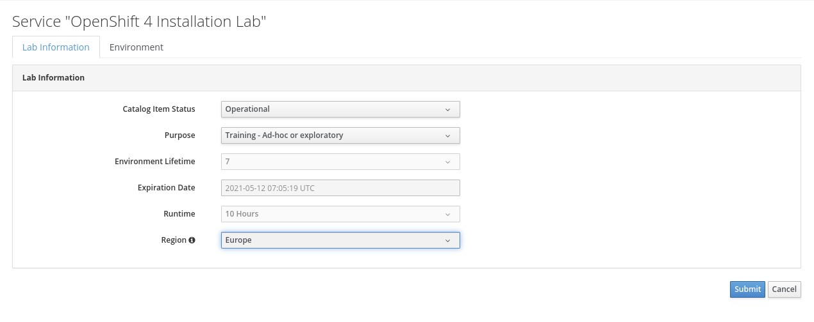

# Openshift 4 OpenTLC Installation Sandbox Automation

## Description
This project is a basic automation to use the OpenShift Installation sandbox on Red Hat
OpenTLC (internal users only).
The purpose of this tool is not automate the sandbox provising (see AgnosticD for that), but
to provide a simple and fast way to generate a custom install-config.yaml and AWS credential file, 
download the necessary binaries and start the installation.

## Prerequisites
Ansible 2.9+ must be installed on the system. Supported systems are Linux and Mac OS. 

The following additional packages must be installed:
- Python Netaddr to manipulate addressed (`python3-netaddr` on Fedora/RHEL)
- Python OpenShift to access OpenShift API (`python3-openshift` on Fedora/RHEL)

The following Ansible Collections are required:
- `ansible.netcommon`, used to apply IP filtering
- `kubernetes.core`, used to test installation results

On Mac OS **homebrew** must be installed to manage extra packages.

To install them:
```
$ ansible-galaxy collection install -r requirements.yml
```

## How to use
First, loging to https://labs.opentlc.com to order a new **OpenShift 4 Installation Lab** sandbox under  
```
Services ->  
    Catalog ->  
        OPENTLC OpenShift 4 Labs ->  
            OpenShift 4 Installation Lab
```      


  
  
Click on the **Order** button and complete the request form by submitting the order the lab reason, 
the provisioning AWS region and by accepting terms and conditions. 
  


  


When OpenTLC provisioning is complete, an e-mail will be sent to the requesting user with 
informations about the temporary Sandbox environment.

The important informations in the OpenTLC e-mails appear as follows:
```
Here is some important information about your environment:

Top level domain: .sandboxNNN.opentlc.com

WARNING: with great power comes great responsibility. We monitor usage.
Your AWS programmatic access:
aws_access_key_id = XXXXXXXXXXXXXXXXXXXX
aws_secret_access_key = xxxxxxxxxxxxxxxxxxxxxxxxxxxxxxxxxxxxxxxx

SSH Access: ssh <username>@<bastion_url>
SSH password: xxxxxxxxxx
```

**IMPORTANT**: Remember that all OpenTLC labs are time constrained and will be destroyed after a variable amount of time (usually 4/5 working days).
  

### Cluster deployment
After receiving the informations run the cluster deploy playbook locally:
```
$ ansible-playbook cluster_deploy.yaml
```
  
Ansible will prompt for **sudo** password to install the latest `oc` and `openshift-install` 
binaries under the `/usr/local/bin` path.

Users are expected to provide the following mandatory informations, prompted during the playbook execution.
- `base_domain`: the sandbox base domain that will be used to expose APIs and Ingress
- `aws_access_key_id`: the AWS acces key id available in the received e-mail.
- `aws_secret_access_key`: the AWS secret access key available in the received e-mail.
- `pull_secret`: the Red Hat pull secret necessary to pull the cluster images
- `ssh_key`: the public SSH key that will be injected in the nodes
- `install_dir`: the installation directory where install files and logs will be created

After the installation login to the cluster using the provided informations 
in the Ansible output or in the `.openshift_install.log` file in the installation
directory.

Under `install_dir/auth` the installation deploy the `kubeconfig` file.

### Cluster destroy
The OpenTLC labs use AWS sandboxes for demo and training purposes but it is
important to avoid unnecessary compute resource usage, for cost and 
environmental reasons. After finishing using a cluster destroy it using
the follwing command:

```
$ ansible-playbook cluster_destroy.yaml
```

The `install_path` variable will be prompted again to confirm the previous
installation directory.


### Optional Extra Configs
Optionally, users can customize clusters by editing the `cluster_config_vars.yaml`.
For example if a different flavor for worker nodes is necessary.
Available extra configs, with their predefined values, are:

```
---
# Cluster name
cluster_name: ocp4

# Sizing of master nodes
master_flavor: m5.xlarge

# Sizing of worker nodes.
worker_flavor: m5.large

# Number or worker replicas.
worker_replicas: 3

# AWS install region
aws_region: eu-central-1

# Network type. Supported values: OpenShiftSDN, OVNKubernetes
network_type: OpenShiftSDN

# The service network used top allocate service vips. To test Submariner
# multicluster connectivity be sure to use diffrenet CIDRs.
service_network: 172.30.0.0/16

# Enable FIPS mode
fips_enabled: false
```

### Debugging
Sometimes it is useful to repeat the pre and post install tasks for debugging
purposes without having to redeploy the cluster. To do so, skip the install task 
using the `--skip-tags` option:
```
$ ansible-playbook cluster_deploy.yaml --skip-tags install
```

## Maintainers
Gianni Salinetti <gsalinet@redhat.com>  

