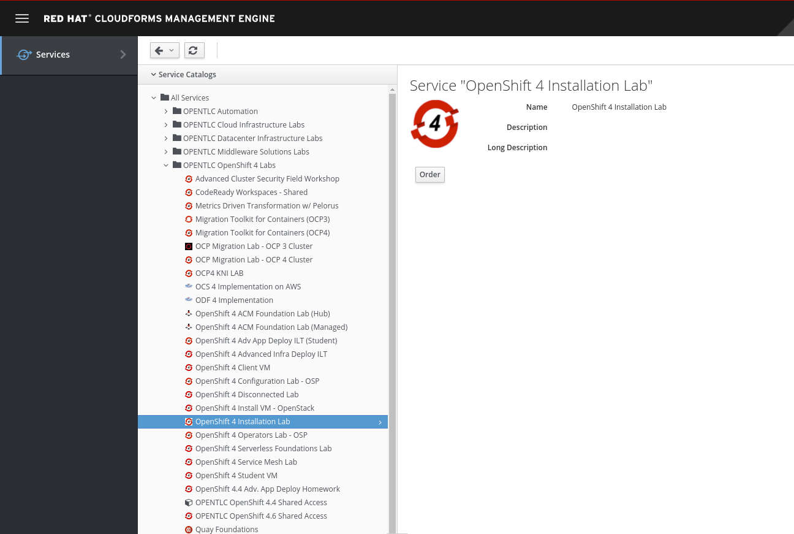

# Openshift 4 OpenTLC Installation Sandbox Automation

## Description
This project is a basic automation to use the OpenShift Installation sandbox on Red Hat
OpenTLC (internal users only).
The purpose of this tool is not automate the sandbox provising (see AgnosticD for that), but
to provide a simple and fast way to generate a custom install-config.yaml and AWS credential file, 
download the necessary binaries and start the installation.

## Prerequisites
Ansible must be installed on the system. Supported systems are Linux and Mac OS.
## How to use
First, go to https://labs.opentlc.com to order a new **OpenShift 4 Installation Lab** sandbox.
  


  

Complete the request form by submitting the order reason and the provisioning region.
When OpenTLC provisioning is complete, a mail will be sent to the requesting user with 
informations about the temporary Sandbox environment.

Run the playbook locally:
```
$ ansible-playbook deploy.yaml
```

Ansible will prompt for **sudo** password to install the binaries under `/usr/local/bin`.

Users are expected to provide the following mandatory informations, prompted during the playbook execution.
- **base_domain**: the sandbox base domain that will be used to expose APIs and Ingress
- **aws_access_key_id**: the AWS acces key id available in the received e-mail.
- **aws_secret_access_key**: the AWS secret access key available in the received e-mail.
- **pull_secret**: the Red Hat pull secret necessary to pull the cluster images
- **ssh_key**: the public SSH key that will be injected in the nodes
- **install_dir**: the installation directory where install files and logs will be created

### Optional Extra Configs
Optionally, users can customize clusters by editing the `cluster_config.yaml`.
For example if a different flavor for worker nodes is necessary.
Available extra configs, with their predefined values, are:
```
---
cluster_name: ocp4
master_flavor: m5.xlarge
worker_flavor: m5.large
worker_replicas: 3
aws_region: eu-central-1
```

## Maintainers
Gianni Salinetti <gsalinet@redhat.com>  

